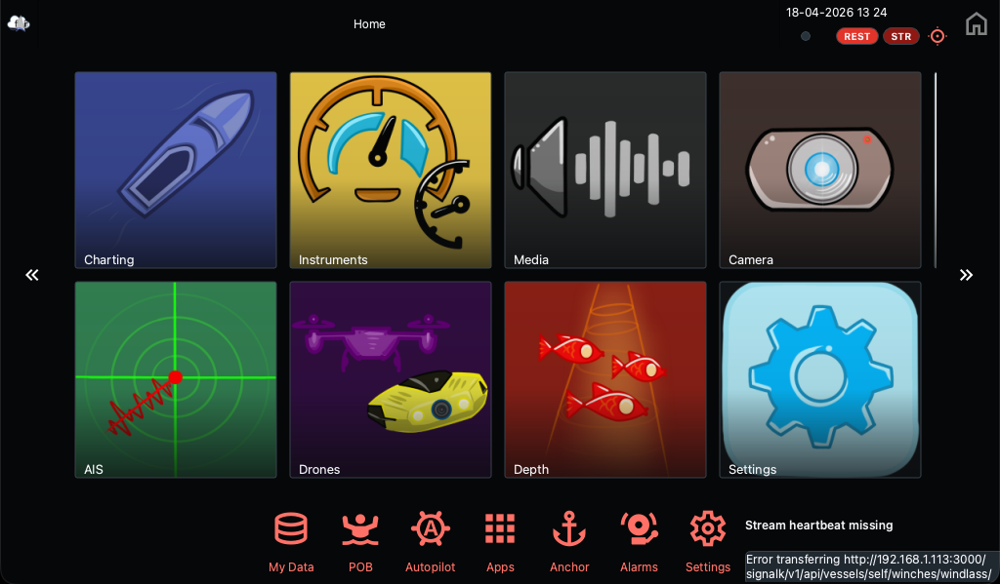
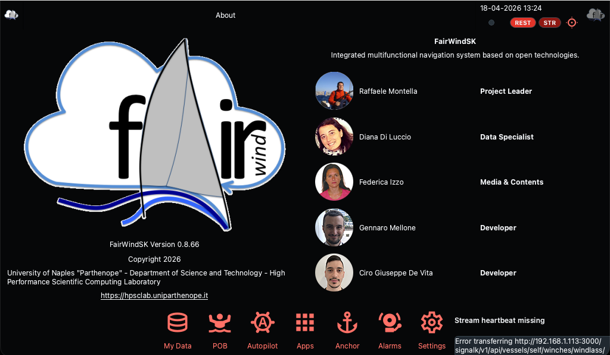
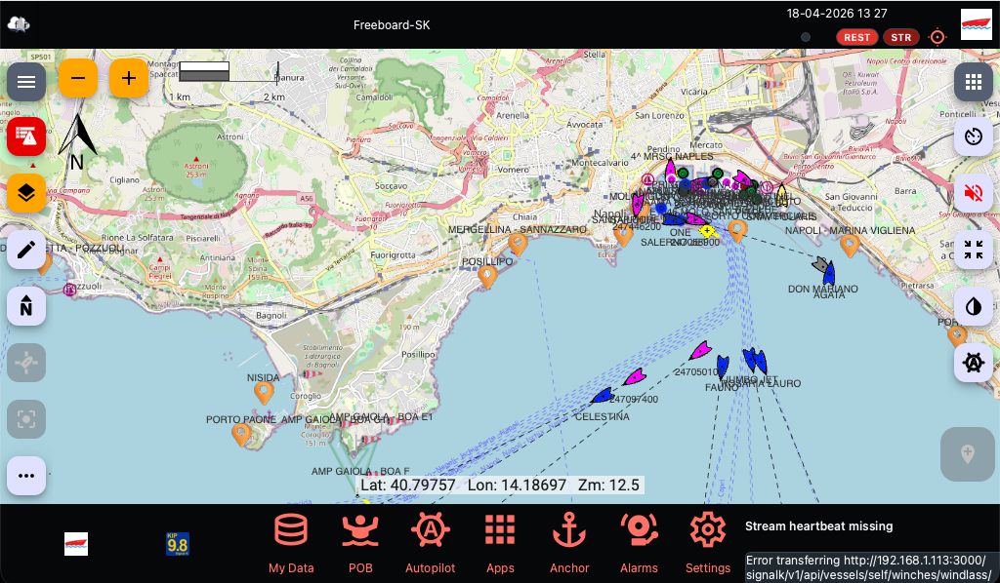
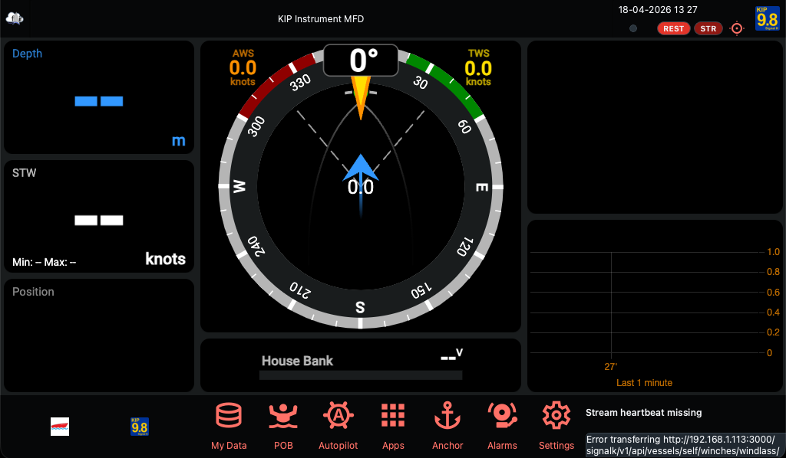
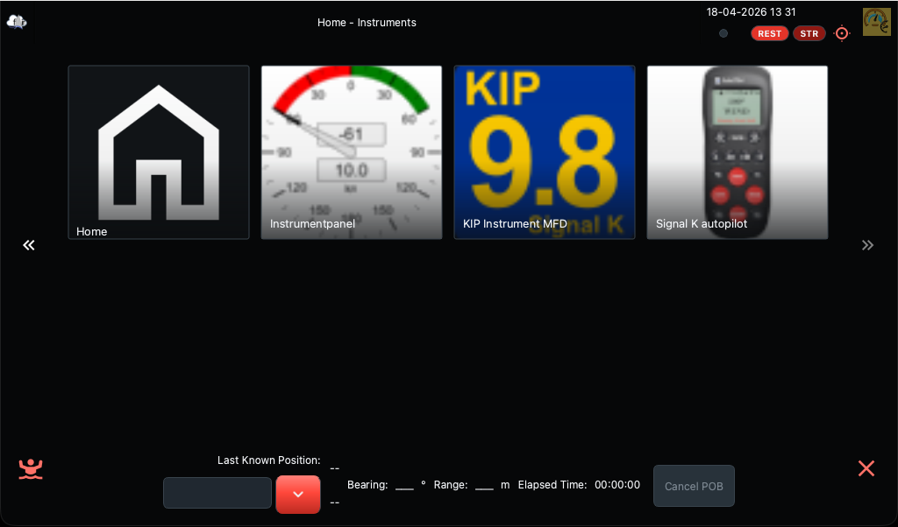
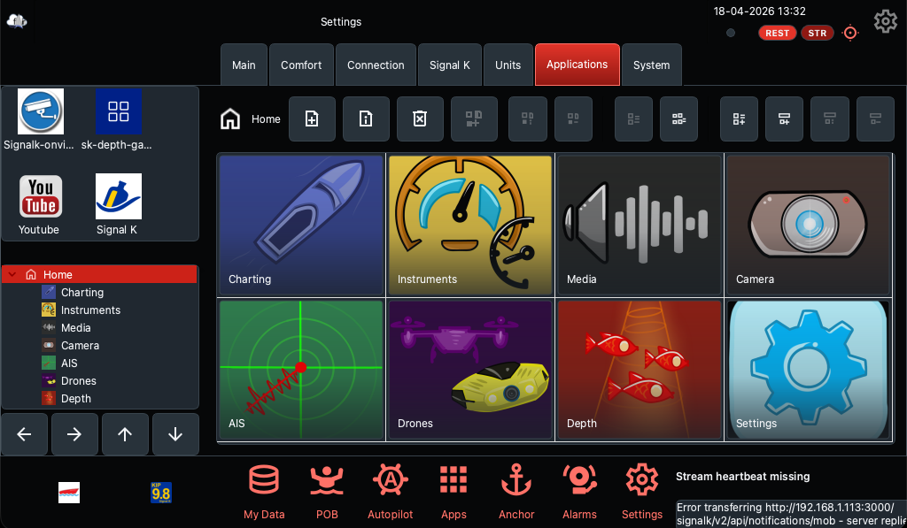

# FairWindSK
A QT-based browser designed to be a companion of the Signal K server

# Introduction
FairWindSK is part of DYNAMO research projects (now supported by the DataX4Sea project, a research grant from
NEC Laboratory of America to test its DataX framework in data crowdsourcing for coastal environmental protection).

The final goal of all the DYNAMO projects is data crowdsourcing for coastal environmental protection and weather/ocean
forecasting (numerical) and prediction (AI) models. All results of projects funded by public institutions are
open-source and open-data.

FairWindSK is a browser with steroids designed to host SK applications.
It is written in C++ 17 and QT6.
It runs on Mac, Linux, and Raspberry Pi OS. It probably works on Windows, too, but I never built it under this OS.
I’d like to port it under Android and iOS QT Apps with the same source approach, but for now, I’m focused on
stabilizing it on the already supported platforms.



### Stable components ###
* the desktop (of course, a far remembrance of other similar user interfaces);
* the execution environments;
* the setup and configuration of units;
* the QT virtual keyboard;
* Signal K paths;
* Signal K Applications;
* The autopilot bar;
* POB (Person over board) bar;
* Anchor bar;
* Alarm bar

Those bars will relay on SK web apps invoking their APIs or access the Signal K APIs directly. 

Applications are SK Web Apps hosted by the SK server, but they can also be other web applications manually configured
by providing the URL.

Applications can also be local (as OpenCPN) characterized by a local path URL with the schema file://.

A mechanism to be back on the FairWindSK desktop after being launched in implemented as SHIFT+TAB hot key.

# Compile on MacOS

Install Homebrew
```
/bin/bash -c "$(curl -fsSL https://raw.githubusercontent.com/Homebrew/install/HEAD/install.sh)"
```

Install the dependencies
```
brew install qt@6 cmake
```

Clone the repository

```
git clone https://github.com/OpenFairWind/FairWindSK.git
```

Enter in the repository directory.

```
cd FairWindSK
```

Create the build directory.

```
mkdir build
```

Enter the build directory.

```
cd build
```

Configure the building environment.

```
cmake ..
```

Make FairWindSK

```
make
```
# Compile on Raspberry Pi

Install the compiling environment.

```
sudo apt install qml6-module-qt-labs-folderlistmodel qml6-module-qtquick-window qml6-module-qtquick-layouts qml6-module-qtqml-workerscript libnss-mdns avahi-utils libavahi-compat-libdnssd-dev libxkbcommon-dev qt6-base-dev qt6-base-dev-tools qt6-webengine-dev qt6-webengine-dev-tools qt6-websockets-dev libqt6svg6-dev qt6-virtualkeyboard-dev libqt6virtualkeyboard6 qt6-virtualkeyboard-plugin qmake6 qmake6-bin build-essential cmake
```

Fix a file missing issue.

```
sudo touch /usr/lib/aarch64-linux-gnu/cmake/Qt6VirtualKeyboard/Qt6VirtualKeyboardConfigVersionImpl.cmake
```

Clone the repository

```
git clone https://github.com/OpenFairWind/FairWindSK.git
```

Enter in the repository directory.

```
cd FairWindSK
```

Create the build directory.

```
mkdir build
```

Enter the build directory.

```
cd build
```

Configure the building environment.

```
cmake ..
```

Make FairWindSK

```
make
```

# Run on Raspberry Pi

```
sudo apt install qml6-module-qt-labs-folderlistmodel qml6-module-qtquick-window qml6-module-qtquick-layouts qml6-module-qtqml-workerscript libnss-mdns avahi-utils libavahi-compat-libdnssd libqt6websockets6 libqt6webenginewidgets6 libqt6webenginecore6 libqt6positioningquick6 libqt6widgets6 libqt6network6 libqt6gui6 libqt6core6 libqt6quickwidgets6 libqt6quickwidgets6 libqt6webchannel6 libqt6qml6 libqt6dbus6 libqt6qmlmodels6 libqt6opengl6 libqt6virtualkeyboard6 qt6-virtualkeyboard-plugin
```

# Setup for production

Copy the executable

```
sudo cp FairwindSK /usr/local/bin
```

Copy the icons in home

```
cp icons $HOME/
```

# Run in production

```
FairWindSK
```

# Signal K server on Docker

Release process first publishes the server's modules to npm. Docker images are then built using the just published npm packages. Images (including older versions) are available at [Docker Hub](https://hub.docker.com/r/signalk/signalk-server) and starting from v2 at [GitHub Container registry](https://github.com/orgs/SignalK/packages/container/package/signalk-server). Going forward **use the full image name, including the registry cr.signalk.io**. That address will be updated to redirect to the recommended registry where the latest released version can be found.

Release images:
- cr.signalk.io/signalk/signalk-server:latest
- cr.signalk.io/signalk/signalk-server:`<release tag>`, e.g. `v1.40.0`

Supported os/architectures:
- linux/amd64
- linux/arm/v7
- linux/arm64

## Quickstart

Create a directory for persistent configuration

```
mkdir $HOME/.signalk
```

You can start a local server on port 3000  with demo data with

```
docker run --init -it --rm --name signalk-server --publish 3000:3000 --entrypoint /home/node/signalk/bin/signalk-server -v $HOME/.signalk:/home/node/.signalk cr.signalk.io/signalk/signalk-server --sample-nmea0183-data
```

For real use you need to persist /home/node/.signalk where the server's configuration is stored, with for example

```
docker run -d --init  --name signalk-server -p 3000:3000 -v $HOME/.signalk:/home/node/.signalk cr.signalk.io/signalk/signalk-server
```
This will run the server as background process and current directory as the settings directory. You will be prompted to create admin credentials the first time you you access the configuration admin web UI.

## Image details and used tags

Signal K Server docker images are based on Ubuntu 20.04 LTS. During build process, Node 16.x is installed including tools required to install or compile plugins. Signalk support mDNS from docker, uses avahi for e.g. mDNS discovery. All required avahi tools and settings are available for user `node`, also from command line.

### Release images

Release images `docker/Dockerfile_rel` are size optimized and there are only mandatory files in the images. During the release process updated npm packages in the server repo are built and published to npmjs. Release docker image is then built from the published npm packages like Signal K server is installed normally from npmjs.

### Development images

Development images `docker/Dockerfile`include all files from the Signal K server repository's master branch and these images are targeted mainly for development and testing. Development images are built off the files in the repo, including the submodules from `packages` directory.

Development images are tagged `<branch>` (mainly `master`) and `sha`:

```
docker run --init --name signalk-server -p 3000:3000 -v $HOME/.signalk:/home/node/.signalk cr.signalk.io/signalk/signalk-server:master
```

### Directory structure

* server files: `/home/node/signalk`
* settings files and plugins: `/home/node/.signalk`

You most probably want to mount `/home/node/.signalk` from the host or as a volume to persist your settings.

# Gallery

The developer team is lead by Prof. Raffaele Montella.


An example of a Signal K web application running wrapped by FairWindSK: The [Freeboard-SK](https://github.com/SignalK/freeboard-sk) chart-plotter application. 


An example of a Signal K web application running wrapped by FairWindSK: The [KIP](https://github.com/mxtommy/Kip) instrument package application.


The Person over Board bar. If the POB button is pressed, the POB bar popup.
A waypoint is dropped automatically and set as destination.
The bar shows the last known position, the bearing to and the distance from the last known position,
and the elapsed time.


The application settings: here it is possible to manage the applications shown on the desktop.
