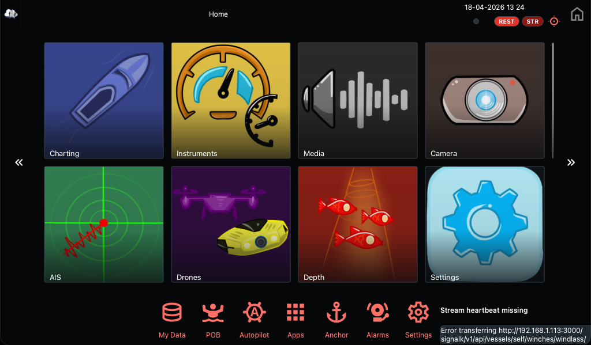
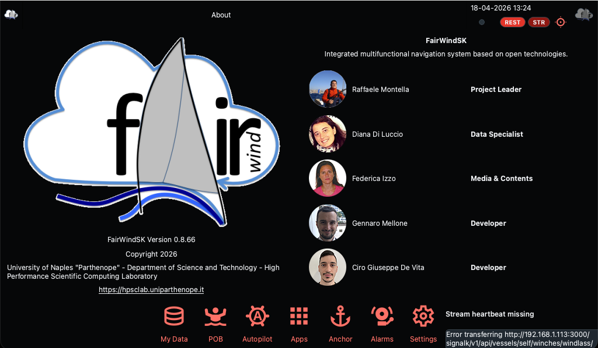
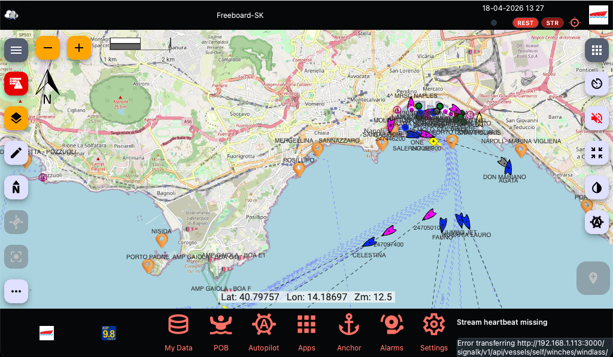
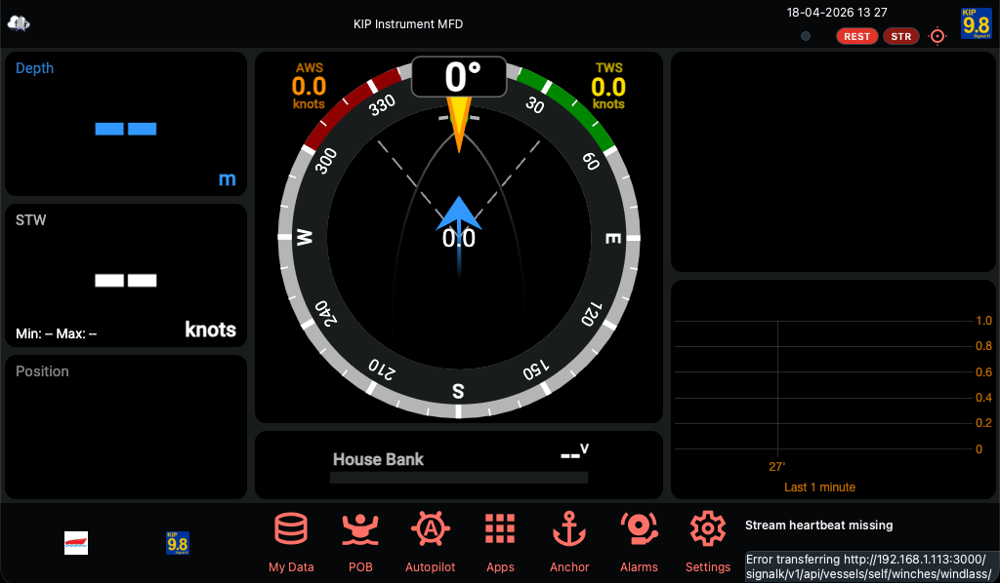
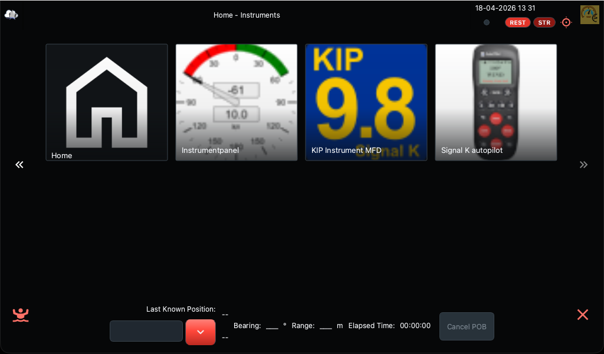
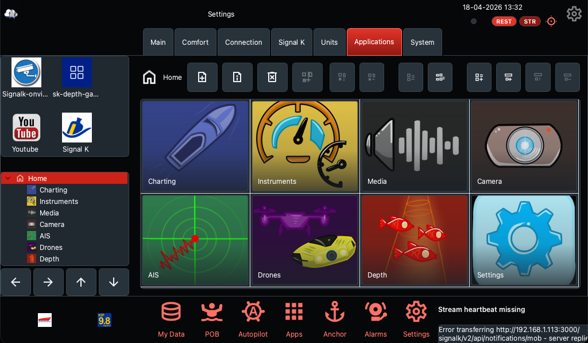
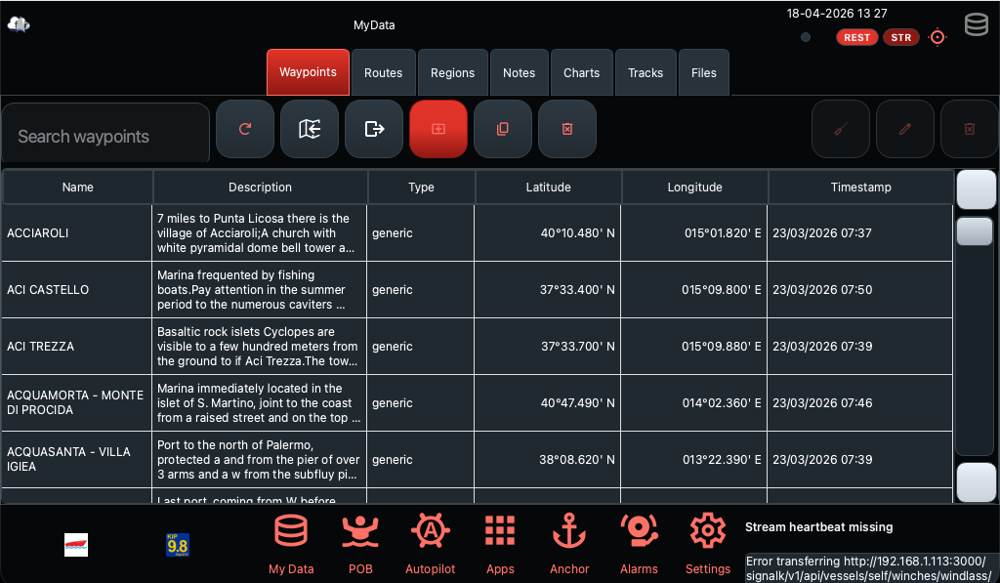
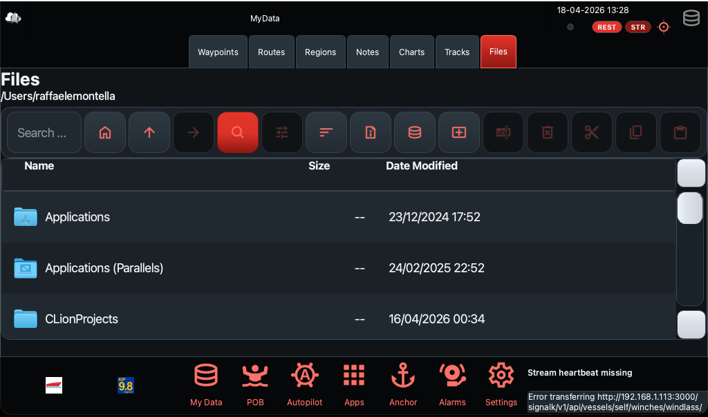
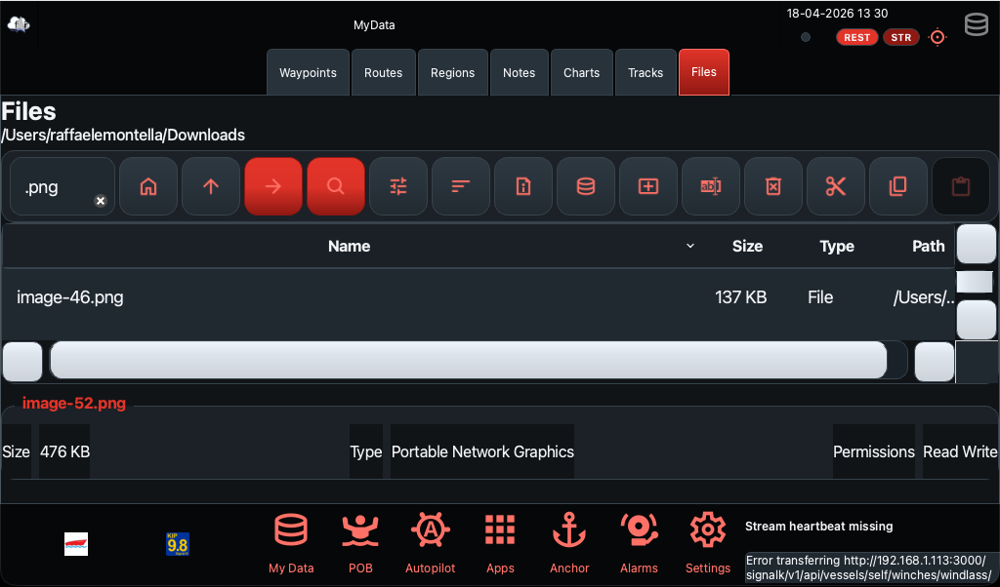
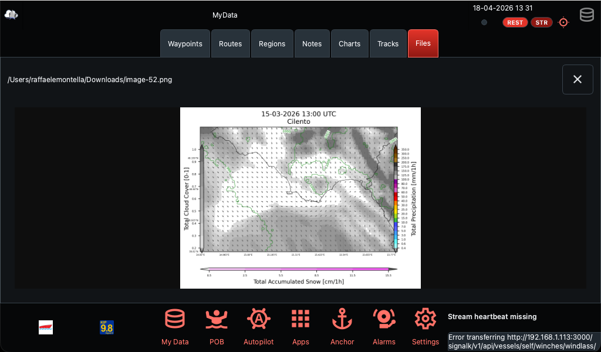

# FairWindSK

A touch-first, cross-platform marine Multi-Functional Display and Signal K application host.

# Introduction
FairWindSK is part of DYNAMO research projects (now supported by the DataX4Sea project, a research grant from
NEC Laboratory of America to test its DataX framework in data crowdsourcing for coastal environmental protection).

The final goal of all the DYNAMO projects is data crowdsourcing for coastal environmental protection and weather/ocean
forecasting (numerical) and prediction (AI) models. All results of projects funded by public institutions are
open-source and open-data.

FairWindSK is written in C++17 and Qt 6. It combines a native marine instrument shell, vessel operations, configuration and data-management tools, and embedded Signal K web applications in one landscape window. Desktop targets use Qt WebEngine Widgets; Android and iOS/iPadOS use Qt WebView behind the same application-host interfaces.

Android 13 (API 33) is the minimum supported Android runtime. The Android build can optionally be selected as the device Home app without changing the default automatically. Its Android-only settings page discovers installed launchable applications, lets the operator choose which ones join the shared FairWindSK application palette, and places them on the same marine-MFD launcher pages as Signal K web applications.
The runtime now supervises Signal K restarts as well: if the server drops and comes back, FairWindSK re-discovers the server, reconnects the websocket stream, restores subscriptions, and refreshes server-backed resources so the UI stays consistent with the restarted backend.

## Documentation

* [Getting started](docs/getting_started.md)
* [Building FairWindSK](docs/building.md)
* [Building FairWindSK on macOS](docs/macos.md)
* [Building FairWindSK on Windows](docs/windows.md)
* [Building and running FairWindSK on Linux](docs/linux.md)
* [Building and running FairWindSK on Raspberry Pi OS](docs/raspberrypi.md)
* [Building and running FairWindSK in a container](docs/container.md)
* [Android environment, APK build, signing, deployment, and launcher guide](docs/android.md)
* [iOS environment, iPad Simulator build, deployment, and debugging guide](docs/ios.md)
* [Architecture overview](docs/architecture.md)
* [Developing guide](docs/developing_guide.md)
* [UI shell definition](docs/ui_shell.md)
* [Configuration guide](docs/configuring.md)
* [Running a companion Signal K Server with Docker](docs/signalk-server-docker.md)
* [GUI tour](docs/gui.md)
* [Research contextualization](docs/research.md)
* [Typical use cases](docs/use_case.md)



## Available features

### Marine MFD shell and instruments

* A single-window, landscape shell composed of the Top Bar, Application Area, Bottom Bar, horizontal action drawer, and vertical application drawer
* Configurable live navigation instruments including position, COG, SOG, heading, speed through water, depth, waypoint, bearing, distance, time-to-go, ETA, cross-track error, and velocity made good
* Clear live, stale, missing, connection, and Signal K health states
* Touch-first controls, Qt Virtual Keyboard integration, high-contrast OpenBridge-inspired presentation, and readable helm-distance layouts
* Six comfort presets: `Default`, `Dawn`, `Day`, `Sunset`, `Dusk`, and `Night`, with editable palettes, styles, and theme images
* Multilingual native and embedded-web locale coordination, with English fallback for unsupported locales

### Signal K connectivity and applications

* Signal K discovery, manual server selection, authentication, REST requests, websocket subscriptions, and connection health reporting
* Automatic recovery after network interruption or Signal K restart, including rediscovery, websocket reconnect, subscription restoration, and server-backed UI refresh
* Discovery of Signal K web applications and their artwork, plus manually configured web URLs
* An embedded application host that keeps web apps inside FairWindSK rather than opening external browser windows
* A paged and nested launcher with application tiles, touch-friendly page assignment, app editing, icon selection, and an Apps action that always returns home
* Responsive asynchronous mobile loading for server-provided applications, units, resources, tracks, and system diagnostics

### Navigation, safety, and vessel control

* Person Over Board support for multiple incidents, last-known position, bearing, range, elapsed time, Signal K MOB notification, incident waypoint creation, destination selection, and cancellation
* Anchor monitoring and alarm access from the shared operational shell
* Signal K alarm and notification presentation
* Autopilot controls when a compatible Signal K autopilot plugin and APIs are available: next waypoint, wind-vane mode, tack, gybe, port/starboard trim by 1° or 10°, route selection, dodge, and auto mode

### MyData

* Signal K `Waypoints`, `Routes`, `Regions`, `Notes`, `Charts`, and `Tracks`
* Shared resource listing, creation/editing, import, export, deletion, and refresh workflows
* Historical track retrieval and geographic previews for waypoints and GeoJSON-shaped resources
* Freeboard-SK-assisted map focus when that application is available
* Local and remote file browsing, searching, and viewing of images, PDF documents, and text content

### Configuration and diagnostics

* Settings for general behavior, Signal K connection, paths, units, applications, launcher pages, comfort presets, language, system information, and configuration import/export
* Server-provided unit preferences and conversion support without blocking mobile touch interaction
* Per-run logs, crash-report bundles, interaction history, and an in-app diagnostics explorer
* Persistent configuration with safe import and platform-appropriate application data storage

### Platform integration

* Native desktop builds for macOS, Linux, Raspberry Pi OS, and Windows
* Android 13/API 33 and newer, including an optional Android Home role that is never selected automatically
* Android discovery of installed `MAIN + LAUNCHER` activities, selection into the shared application palette, explicit native launching, and conditional soft Back/Home/Recents controls
* iOS and iPadOS device and simulator builds with the FairWindSK application identity and mobile WebView backend
* Raspberry Pi OS kiosk/autostart helpers and OpenPlotter-aware installation
* Linux container compilation, CTest, and headless Qt WebEngine startup checks

Applications are normally Signal K web apps hosted by the connected server, but any compatible web application can be configured by URL.

The launcher enforces the single-window marine display model: configured apps must run as embedded web views, and native `file://` applications are blocked instead of being launched as external windows.

The `SHIFT+TAB` hot key on desktop builds brings the FairWindSK window back to the foreground without relying on external application windows.

## Areas under active development
* Continued Android and iOS real-device validation of the alternate Qt WebView runtime path, including parity checks against the more established desktop WebEngine behavior
* Deeper MyData authoring and UX polish for routes, regions, notes, and charts, especially for geometry-heavy editing, preview depth, and bulk-management workflows
* Continued hardening of the newer shared MyData resource editors and collection pages as they expand beyond the long-standing waypoint and file-centric flows
* Residual Comfort-system cleanup in older designer-driven or custom-painted surfaces so every shell region follows the same preset and contrast rules
* Continued marine-MFD tuning of touch targets, spacing, and readability across desktop, embedded, and mobile deployments as platform-specific ergonomics are validated in use

# Building

The full platform guide now lives in [docs/building.md](docs/building.md).
Complete Android host setup and signed-APK instructions live in [docs/android.md](docs/android.md).
Complete iOS host setup and iPad Simulator instructions live in [docs/ios.md](docs/ios.md).
Complete native macOS environment, build, test, installation, and packaging instructions live in [docs/macos.md](docs/macos.md).
Complete native Windows environment, MSVC build, test, staging, and deployment instructions live in [docs/windows.md](docs/windows.md).
Complete native Linux dependency, build, test, installation, and validation instructions live in [docs/linux.md](docs/linux.md).
Complete Raspberry Pi OS preparation, native build, configuration, kiosk/autostart, OpenPlotter, and validation instructions live in [docs/raspberrypi.md](docs/raspberrypi.md).

Quick summary:

- macOS, Linux, Raspberry Pi OS, and Windows keep the desktop Qt WebEngine Widgets implementation.
- Android and iOS now build through an alternate mobile web layer based on Qt WebView and QQuickWidget hosts.
- Android packaging declares API 33 as its minimum SDK. Package discovery uses only `MAIN + LAUNCHER` visibility rather than the broad `QUERY_ALL_PACKAGES` permission, and installation leaves the existing default Home app unchanged.
- Desktop targets use pinned `QtZeroConf` and `QHotkey` dependencies and download them during the first clean build. CMake downloads the pinned `nlohmann/json` fallback only when a system package is unavailable.
- On Linux desktop installs, `cmake --install build` now also installs the FairWindSK desktop launcher. On Raspberry Pi OS installs it additionally enables the system autostart entry, and when OpenPlotter is detected it performs a best-effort copy into the OpenPlotter menu directories.

Generic workflow:

```bash
git clone --branch main https://github.com/OpenFairWind/FairWindSK.git
cd FairWindSK
cmake -S . -B build
cmake --build build --parallel
cmake --install build
```

Replace `--branch main` with `--branch <release-tag>` to build a published
release. Do not use a feature or legacy integration branch as the default
installation source.

For the supported-flavor matrix and direct links to every authoritative platform guide, see [docs/building.md](docs/building.md).

# Connecting a Signal K server

FairWindSK is a Signal K client and application host; the Signal K Server is a
separate upstream project. If a server is not already available on the vessel
network, follow [the focused Docker quickstart](docs/signalk-server-docker.md) or
the upstream Signal K installation documentation. Server image internals,
release processes, and development tags are intentionally kept out of this
application README.

# Citing DYNAMO/FairWind in scientific papers

* Montella, Raffaele, Diana Di Luccio, Livia Marcellino, Ardelio Galletti, Sokol Kosta, Giulio Giunta, and Ian Foster.
"Workflow-based automatic processing for internet of floating things crowdsourced data."
Future generation computer systems 94 (2019): 103-119.
[link](https://www.sciencedirect.com/science/article/pii/S0167739X18307672)


* Di Luccio, Diana, Sokol Kosta, Aniello Castiglione, Antonio Maratea, and Raffaele Montella.
"Vessel to shore data movement through the internet of floating things: A microservice platform at the edge."
Concurrency and Computation: Practice and Experience 33, no. 4 (2021): e5988.
[link](https://onlinelibrary.wiley.com/doi/abs/10.1002/cpe.5988)


* Montella, Raffaele, Sokol Kosta, and Ian Foster.
"DYNAMO: Distributed leisure yacht-carried sensor-network for atmosphere and marine data crowdsourcing applications."
In 2018 IEEE International Conference on Cloud Engineering (IC2E), pp. 333-339. IEEE, 2018.
[link](https://ieeexplore.ieee.org/document/8360350)


* Montella, Raffaele, Diana Di Luccio, Sokol Kosta, Giulio Giunta, and Ian Foster.
"Performance, resilience, and security in moving data from the fog to the cloud: the DYNAMO transfer framework approach."
In International Conference on Internet and Distributed Computing Systems, pp. 197-208. Cham: Springer International Publishing, 2018.
[link](https://link.springer.com/chapter/10.1007/978-3-030-02738-4_17)

  
* Di Luccio, Diana, Angelo Riccio, Ardelio Galletti, Giuliano Laccetti, Marco Lapegna, Livia Marcellino, Sokol Kosta, and Raffaele Montella.
"Coastal marine data crowdsourcing using the Internet of Floating Things: Improving the results of a water quality model."
IEEE Access 8 (2020): 101209-101223.
[link](https://ieeexplore.ieee.org/document/9098885)


* Montella, Raffaele, Mario Ruggieri, and Sokol Kosta.
"A fast, secure, reliable, and resilient data transfer framework for pervasive IoT applications."
In IEEE INFOCOM 2018-IEEE conference on computer communications workshops (INFOCOM WKSHPS), pp. 710-715. IEEE, 2018.
[link](https://ieeexplore.ieee.org/document/8406884)


# Gallery

The developer team is lead by [Prof. Raffaele Montella](https://raffaelemontella.it).


An example of a Signal K web application running wrapped by FairWindSK: The [Freeboard-SK](https://github.com/SignalK/freeboard-sk) chart-plotter application. 


An example of a Signal K web application running wrapped by FairWindSK: The [KIP](https://github.com/mxtommy/Kip) instrument package application.


The Person over Board bar. If the POB button is pressed, the POB bar popup.
FairWindSK raises the standard `notifications.mob` alarm on the connected Signal K server,
creates a regular waypoint resource for the incident, and sets that waypoint as destination.
The bar shows the last known position, the bearing to and the distance from the last known position,
and the elapsed time.


The application settings: here it is possible to manage the applications shown on the desktop.


My Data: the waypoint management graphical user interface (via Signal K resources)


My Data: the file browser


My Data: the file searcher


My Data: the image viewer


# Open-Source external projects

* [OpenBridge](https://www.openbridge.no) a collection of tools and approaches to improve implementation, design and approval of maritime workplaces and equipment
* [QZeroConf](https://github.com/jbagg/QtZeroConf) a Qt wrapper class for ZeroConf libraries across various platforms.
* [QHotKey](https://github.com/Skycoder42/QHotkey) a global shortcut/hotkey for Desktop Qt-Applications.
