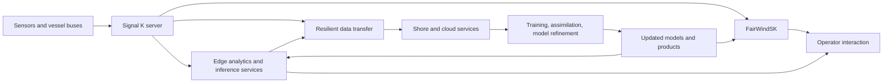

# FairWindSK in the DYNAMO and FairWind Compute Continuum

## Abstract

FairWindSK is a Qt-based Signal K application shell designed for leisure boats and edge-adjacent marine operations.
Within the broader DYNAMO and FairWind research agenda, FairWindSK can be understood as the user-facing execution and interaction layer that sits close to onboard data generation, vessel-local decision support, and operator-in-the-loop model refinement.
This document contextualizes FairWindSK inside a compute continuum that spans onboard sensors, Signal K middleware, edge analytics, federated learning workflows, and downstream cloud or coastal infrastructure used to improve weather, ocean, and marine-environment models.
The current repository primarily implements the vessel-facing runtime shell, application hosting, configuration, and touch-native operational workflows.
Federated learning and AI-based model improvement are therefore discussed here as system-level research directions and integration opportunities rather than as fully implemented features of this repository.

## 1. Introduction

Leisure boats increasingly act as mobile sensing platforms.
They collect navigational, meteorological, and environmental measurements while traversing coastal and offshore areas that are traditionally undersampled by fixed infrastructures.
The DYNAMO and FairWind research lines frame this opportunity as an Internet of Floating Things problem: many heterogeneous, intermittently connected platforms generate data that can support:

- situational awareness aboard the vessel
- resilient edge-to-cloud data transport
- environmental data crowdsourcing
- improved numerical and AI-driven marine and weather models

FairWindSK addresses the interface and execution problem inside this ecosystem.
It provides a touch-friendly, marine-MFD-style shell able to:

- connect to Signal K servers
- host Signal K web applications
- expose native operational widgets such as POB, autopilot, anchor, alarms, MyData, and Settings
- maintain a comfort-preset-aware user experience across multiple dayparts and platforms

In research terms, FairWindSK is not just a browser.
It is the vessel-local human-machine interaction layer through which:

- edge services become operationally usable
- onboard data products are observed and curated
- local applications surface AI- or model-derived information to the operator
- platform-specific runtime constraints are managed without losing domain usability

## 2. State of the art

### 2.1 Marine data acquisition and the Internet of Floating Things

Recent work in DYNAMO and related research argues that leisure boats can serve as mobile environmental sensing nodes.
Compared with sparse fixed stations, vessels offer broader spatial coverage and repeated trajectories across areas relevant to coastal dynamics, air-sea interaction, and water-quality monitoring.
The challenge is that these nodes are:

- mobile
- heterogeneous
- intermittently connected
- operated by non-specialist users
- subject to operational and safety constraints

This creates a need for edge-capable, failure-tolerant, operator-friendly systems.

### 2.2 Signal K as the onboard interoperability layer

Signal K has emerged as a practical open standard for vessel data interoperability.
It aggregates sources such as:

- GPS
- wind sensors
- depth instruments
- engine data
- autopilot state
- user annotations and resources

Signal K’s open APIs and plugin ecosystem make it a strong basis for:

- onboard dashboards
- route and waypoint management
- notification handling
- downstream analytics integration

FairWindSK leverages Signal K as the common semantic and transport substrate.

### 2.3 Edge computing and compute continuum architectures

The DYNAMO/FairWind view aligns with compute continuum thinking:

- **device tier**
  sensors and instrument buses
- **vessel edge tier**
  Signal K server, local applications, FairWindSK, and edge inference or filtering services
- **shore or cloud tier**
  storage, training, assimilation, retrospective analysis, and model publication

This continuum is attractive because it keeps time-sensitive and bandwidth-sensitive tasks near the boat while still enabling higher-order analytics and learning upstream.

### 2.4 Federated learning and AI for marine systems

Federated learning offers a promising mechanism for exploiting vessel-distributed data while reducing raw-data centralization.
In such a design:

- boats keep sensitive or high-volume data local
- local models or parameter updates are computed onboard or near-edge
- only selected gradients, weights, summaries, or privacy-preserving aggregates are shared

For leisure boats and citizen-science scenarios, this is attractive because it may:

- reduce bandwidth usage
- preserve partial data sovereignty
- keep the system functional during intermittent connectivity
- enable collective improvement of forecast-assistance or anomaly-detection models

FairWindSK does not currently implement federated learning itself, but it can serve as the operational front end for applications that expose these workflows.

## 3. Design

### 3.1 Position of FairWindSK in the system

FairWindSK is best positioned as the vessel-local presentation and interaction layer.
Its role is to translate system capabilities into usable operator workflows.

Within the DYNAMO/FairWind continuum, FairWindSK sits between:

- the onboard data and middleware layer, mainly Signal K
- the user-facing execution environment for native and web applications

This placement gives it four research-relevant functions:

1. **application hosting**
   It runs Signal K web apps and selected local apps inside a consistent shell.
2. **operational mediation**
   It exposes critical functions such as alarms, POB, anchor, and autopilot access through native bars.
3. **data awareness**
   It surfaces live Signal K data and server-backed resources to the operator.
4. **human-in-the-loop control**
   It can become the front end through which edge AI outputs, environmental products, and learning status are reviewed or acted upon.

### 3.2 Compute continuum interpretation

The broader system can be described as follows:

In this view:

- Signal K normalizes onboard data
- FairWindSK operationalizes it for a human operator
- edge analytics produce derived insight
- shore or cloud systems aggregate, train, assimilate, and redistribute improved products

### 3.3 Why a native shell matters

A purely browser-only solution is often insufficient for marine use.
FairWindSK adds:

- a persistent top and bottom shell
- touch-native modal flows
- comfort presets aligned with day/night transitions
- stable operational entry points independent of individual web app quality
- support for multiple build targets with a consistent interaction model

These properties matter because any AI-augmented or learning-enabled onboard system only becomes useful if the operator can trust and use it under real navigation conditions.

## 4. Implementation

### 4.1 Repository scope versus system scope

The current FairWindSK repository implements the vessel-local shell, not the entire DYNAMO/FairWind compute continuum.
Concretely, the repository already provides:

- a Qt6 and C++17 native runtime
- Signal K REST and websocket connectivity
- app discovery and application hosting
- reconnect recovery after Signal K restarts
- comfort-preset-driven UI theming
- touch-friendly reusable widgets
- cross-platform desktop and mobile build paths

What is not fully implemented here as a first-class subsystem:

- federated learning orchestration
- privacy-preserving aggregation logic
- model training pipelines
- numerical-model assimilation back ends
- fleet-wide experiment management

Those capabilities belong to the larger research architecture around FairWindSK rather than to the GUI shell alone.

### 4.2 Current software architecture

The implemented architecture can be summarized as:

- `main.cpp`
  bootstraps the process and platform-specific runtime
- `FairWindSK`
  orchestrates configuration, Signal K connection, app registry, and runtime reconfiguration
- `Configuration`
  stores persistent user and shell settings
- `signalk::Client`
  handles discovery, REST calls, websocket streaming, and reconnect logic
- `ui/MainWindow`
  composes the shell and manages overlays and bottom-drawer dialogs
- `ui/topbar`, `ui/bottombar`, `ui/settings`, `ui/mydata`, `ui/web`, and `ui/widgets`
  provide the operational feature surfaces

### 4.3 Platform targets as part of the research story

The multi-target build strategy is important in research deployments because vessel and testbed hardware is heterogeneous.
FairWindSK currently supports:

- Linux
- Raspberry Pi OS
- macOS
- Windows
- Android
- iOS

Desktop targets use Qt WebEngine Widgets.
Android and iOS use a mobile-safe Qt WebView path.
This allows a common shell model across:

- helm-adjacent Raspberry Pi screens
- laptops used during development or testing
- tablets and phones used as lightweight onboard terminals

### 4.4 Touch-friendly design as an edge-enablement mechanism

Touch-friendly design is not cosmetic in this context.
It is part of the system’s deployability on real boats.
The implemented strategy includes:

- large touch targets
- stable top and bottom shell bars
- drawer-based modal workflows
- comfort presets for visibility over dayparts
- reusable touch components such as `TouchFileBrowser` and `TouchColorPicker`

This makes FairWindSK suitable as the vessel-local control and review interface for broader edge or AI workflows.

## 5. Evaluation

### 5.1 Functional evaluation

From the repository contents and runtime structure, FairWindSK can be evaluated positively in the following dimensions:

- it provides a robust user-facing shell around Signal K rather than exposing users directly to heterogeneous web apps
- it includes reconnect and recovery logic that matters in unstable onboard network conditions
- it supports cross-platform deployment, including Raspberry Pi and mobile targets
- it includes domain-specific native panels for safety- and navigation-relevant workflows

### 5.2 Research-system evaluation

In the compute-continuum framing, FairWindSK’s main evaluated contribution is not model training but interface and execution stability at the edge.
This matters because:

- distributed data acquisition systems need a reliable onboard interaction point
- AI outputs need operator-facing surfaces
- onboard data validation and workflow control often require human supervision

### 5.3 Limits of the current evaluation

This repository alone does not provide enough evidence to claim:

- a complete federated learning implementation
- end-to-end privacy guarantees
- measurable forecast-model improvement caused solely by FairWindSK
- a benchmarked edge-inference framework integrated directly into this codebase

Those claims would require system-level experiments spanning additional components outside this repository.

## 6. Discussion

### 6.1 FairWindSK as a research enabler

The most useful way to interpret FairWindSK in research terms is as an enabling platform.
It solves a set of practical problems that often block real-world experimentation:

- how onboard users launch and switch between vessel applications
- how live vessel data is presented in a unified shell
- how touch interaction remains usable under marine conditions
- how platform heterogeneity is handled without forking the product concept

Without this kind of interface layer, broader edge-computing or AI workflows remain difficult to operationalize aboard leisure boats.

### 6.2 FairWindSK and federated learning

FairWindSK could support federated learning workflows in at least three ways:

1. **model status presentation**
   showing local training, synchronization, or confidence status through onboard applications
2. **operator feedback capture**
   allowing users to confirm, reject, or annotate model outputs
3. **workflow hosting**
   embedding or launching applications responsible for local inference, data curation, or synchronization

This would keep the training framework outside the shell while still making it operationally actionable.

### 6.3 FairWindSK and environmental model improvement

For weather and marine model improvement, FairWindSK’s role is again indirect but important.
By making onboard data services, data review, and operational apps usable, it helps close the loop between:

- raw vessel observations
- curated or filtered edge data products
- upstream aggregation and model improvement
- downstream redistribution of improved products to the vessel

### 6.4 Design tensions

Several tensions remain important for future work:

- openness versus security
- local usability versus cloud-scale experimentation
- general web-app hosting versus tightly controlled native UX
- cross-platform portability versus platform-specific optimization

These tensions are normal in compute-continuum systems and should be made explicit when designing future FairWindSK integrations.

## 7. Conclusion

FairWindSK should be understood as the vessel-edge human-machine interface layer in the broader DYNAMO/FairWind ecosystem.
It is already a concrete, operational software artifact that:

- connects to Signal K
- hosts marine web applications
- exposes touch-friendly native operational workflows
- spans desktop and mobile targets
- supports comfort-aware visibility and MFD-consistent interaction

In the larger research narrative, this makes FairWindSK a key enabler for onboard edge computing and for future AI-augmented workflows.
Its current codebase does not by itself implement the full federated-learning or model-assimilation pipeline, but it provides the interaction substrate through which those capabilities can become operationally meaningful on leisure boats.

## References

1. Montella, R., Di Luccio, D., Marcellino, L., Galletti, A., Kosta, S., Giunta, G., and Foster, I. “Workflow-based automatic processing for internet of floating things crowdsourced data.” *Future Generation Computer Systems*, 94, 103-119, 2019.
2. Di Luccio, D., Kosta, S., Castiglione, A., Maratea, A., and Montella, R. “Vessel to shore data movement through the internet of floating things: A microservice platform at the edge.” *Concurrency and Computation: Practice and Experience*, 33(4), e5988, 2021.
3. Montella, R., Kosta, S., and Foster, I. “DYNAMO: Distributed leisure yacht-carried sensor-network for atmosphere and marine data crowdsourcing applications.” In *2018 IEEE International Conference on Cloud Engineering (IC2E)*, 333-339, 2018.
4. Montella, R., Di Luccio, D., Kosta, S., Giunta, G., and Foster, I. “Performance, resilience, and security in moving data from the fog to the cloud: the DYNAMO transfer framework approach.” In *International Conference on Internet and Distributed Computing Systems*, 197-208, 2018.
5. Di Luccio, D., Riccio, A., Galletti, A., Laccetti, G., Lapegna, M., Marcellino, L., Kosta, S., and Montella, R. “Coastal marine data crowdsourcing using the Internet of Floating Things: Improving the results of a water quality model.” *IEEE Access*, 8, 101209-101223, 2020.
6. Montella, R., Ruggieri, M., and Kosta, S. “A fast, secure, reliable, and resilient data transfer framework for pervasive IoT applications.” In *IEEE INFOCOM 2018 Workshops*, 710-715, 2018.
7. FairWindSK repository documentation, including `README.md`, `docs/architecture.md`, `docs/ui_shell.md`, and `docs/building.md`.

## Notes on interpretation

This document intentionally mixes implemented software facts with research contextualization.
Where the text discusses federated learning, AI-driven model improvement, and compute-continuum orchestration beyond the current repository, it should be read as a system-level framing and forward-looking integration model, not as a claim that all of those subsystems already exist inside this codebase.
