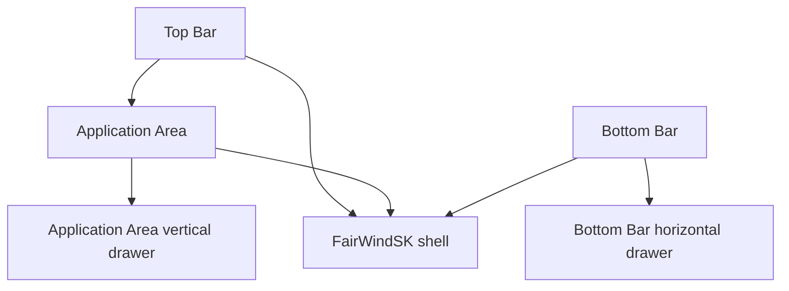
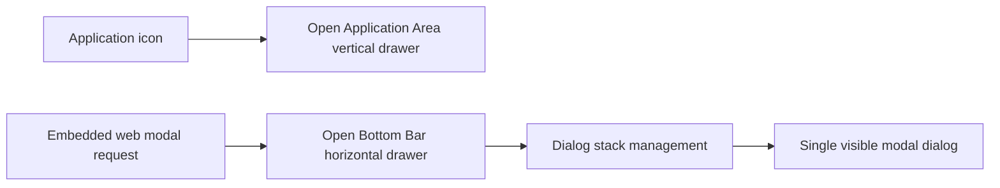

# FairWindSK UI shell definition

This document formally defines the primary user-interface shell components used across FairWindSK.
Use these names consistently in code comments, pull requests, bug reports, and contributor documentation.

These definitions are intentionally platform-neutral and apply to macOS, Windows, Linux, Raspberry Pi OS, Android, and iOS unless a platform-specific limitation is called out elsewhere.

## UI shell overview

```text
+----------------------------------------------------------------------------------+
| Top Bar                                                                         |
| app icon | data widgets | current application name | date/time | status icons   |
+----------------------------------------------------------------------------------+
|                                                                                  |
|                              Application Area                                     |
|                                                                                  |
|                                        +-------------------------------+          |
|                                        | Application Area vertical    |          |
|                                        | drawer                       |          |
|                                        +-------------------------------+          |
+----------------------------------------------------------------------------------+
| Bottom Bar                                                                       |
| open web apps | main application icons | Signal K status                          |
+----------------------------------------------------------------------------------+
| Bottom Bar horizontal drawer (opens upward when active)                          |
+----------------------------------------------------------------------------------+
```

## Component definitions

### Top Bar

The **Top Bar** is the UI area showing:

- the application icon
- the data widgets if available, for example the coordinates
- the current application name
- the date/time
- the status icons

#### Responsibilities

- Present global, always-available status and identity information.
- Preserve a stable layout even while the Application Area content changes.
- Keep high-priority operational cues visible without requiring the operator to leave the current application.

#### Design constraints

- Content must remain readable at normal helm distance.
- Data widgets must not crowd out the application name or critical status icons.
- Iconography and spacing should remain touch-friendly and visually stable across comfort presets.

### Bottom Bar

The **Bottom Bar** is the UI area showing:

- the currently opened web applications in a scrollable area
- the main application icons: `MyData`, `POB`, `Autopilot`, `Apps`, `Anchor`, `Alarms`, `Settings`
- the Signal K status: `Stream`, `API`, `messages`

#### Responsibilities

- Provide fast application switching and core vessel-function entry points.
- Keep the main application icons spatially stable so muscle memory remains reliable.
- Surface Signal K transport and message health without obscuring application controls.

#### Design constraints

- The currently opened web-app area must remain scrollable without displacing the main application icons.
- The main application icons must stay visually centered and evenly spaced.
- Labels and icons must remain readable on compact touch displays, including Raspberry Pi deployments.

### Application Area

The **Application Area** is the UI area between the Top Bar and the Bottom Bar where `MyData`, `Settings`, and all Signal K web applications show their UI.

#### Responsibilities

- Host the active primary view.
- Provide the maximum available working area without compromising the persistent shell controls.
- Support both native Qt widgets and embedded web applications behind the same shell model.

#### Design constraints

- The active view must not visually overlap the Top Bar or Bottom Bar unless a formally defined drawer is temporarily covering it.
- Embedded web content and native widgets must both behave predictably inside the same area.

## Drawer definitions

### Bottom Bar horizontal drawer

The **Bottom Bar horizontal drawer** is a UI element implementing a modal dialog opening upward from the Bottom Bar.
The dialog shows, for example, web modal dialogs.
Only one dialog at a time can be shown.
Multiple dialogs are managed in a stack fashion.
The Bottom Bar horizontal drawer can be extended up to temporarily cover the Application Area.
The UI of dialogs hosted in the Bottom Bar horizontal drawer must fit inside the dialog, avoiding vertical scrolling.

#### Responsibilities

- Host modal interactions that must temporarily capture user attention.
- Provide a consistent FairWindSK-native presentation for embedded web modal flows.
- Manage nested or sequential dialogs using a stack model while keeping only the top dialog visible.

#### Behavioral rules

- It is modal.
- It opens upward from the Bottom Bar.
- Only one visible dialog is allowed at any given time.
- Additional dialogs are pushed and popped in stack order.
- Hosted dialog content must be laid out to fit within the drawer without requiring vertical scrolling.

### Application Area vertical drawer

The **Application Area vertical drawer** is a UI element implementing a non-modal dialog, or tool palette, opening leftward from the right side of the Application Area.
It is used, for example, as a menu for a web application.
The user opens the Application Area vertical drawer by clicking on the application icon.

#### Responsibilities

- Expose contextual application tools without blocking the active application.
- Act as a compact tool palette for the current application context.
- Support repeated open/close cycles while preserving the user’s place in the Application Area.

#### Behavioral rules

- It is non-modal.
- It opens leftward from the right side of the Application Area.
- It is generally invoked from the current application icon.
- It should size itself to its hosted controls rather than consuming unnecessary application space.
- It must allow the operator to continue interacting with the active application when appropriate.

## Relationship schema



## Interaction schema



## Documentation rule

When contributor-facing or user-facing documentation refers to these areas, prefer the formal names from this document instead of ad hoc phrases such as "top section", "main view", "right menu", or "bottom popup".
